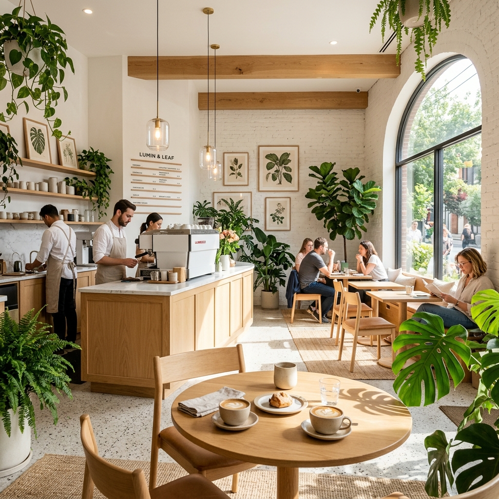

# ☕ Koufee Coffee Shop 

> *"Your Third Place in Purwakarta"* — Tempat nongkrong cozy untuk mahasiswa, freelancer, dan siapapun yang butuh suasana produktif.

[](https://boerhan06.github.io/koufee)
[](https://developer.mozilla.org/en-US/docs/Web/HTML)
[](https://developer.mozilla.org/en-US/docs/Web/CSS)
[](https://developer.mozilla.org/en-US/docs/Web/JavaScript)

---

## 📸 Preview



---

## ✨ Tentang Proyek

**Koufee** adalah website landing page untuk kedai kopi **Koufee Coffee Shop** yang berlokasi di Jl. Taman Pahlawan, Nagri Kaler, Purwakarta. Website ini dibangun dengan desain **Glassmorphism + Botanical** yang premium dan elegan, cocok merepresentasikan suasana kafe yang tenang dan modern.

Website ini sepenuhnya dibangun menggunakan **vanilla HTML, CSS, dan JavaScript** — tanpa framework apapun — namun tetap menghadirkan pengalaman visual yang premium dan animasi yang halus.

---

## 🚀 Fitur Utama

| Fitur | Deskripsi |
|---|---|
| 🎨 **Glassmorphism Design** | UI modern dengan efek kaca buram yang elegan |
| 🌿 **Botanical Theme** | Dekorasi daun SVG yang mempercantik tampilan |
| ✍️ **Typing Animation** | Efek teks mengetik di section hero |
| 🔢 **Counter Animasi** | Angka statistik yang terhitung secara otomatis |
| 🍽️ **Filter Menu** | Filter menu berdasarkan kategori (Kopi, Non-Kopi, Makanan, Snack) |
| 📍 **Google Maps Embed** | Peta lokasi kafe yang terintegrasi langsung |
| 🕐 **Status Buka/Tutup** | Indikator real-time berdasarkan jam operasional |
| 📱 **Responsive Design** | Tampilan optimal di semua ukuran layar |
| 💬 **WhatsApp Integration** | Tombol pesan langsung via WhatsApp |
| 🎭 **Scroll Animations** | Animasi reveal saat elemen masuk ke viewport |
| 🍔 **Mobile Hamburger Menu** | Navigasi mobile yang smooth dan intuitif |
| ⚡ **Font Preloading** | Optimasi performa dengan preload Google Fonts |

---

## 📁 Struktur Proyek

```
koufee-purwakarta/
│
├── index.html          # Struktur utama halaman (single-page)
├── style.css           # Semua styling, animasi, dan desain sistem
├── script.js           # Interaktivitas dan logika JavaScript
│
└── images/
    ├── koufee_hero_*.png   # Gambar hero section
    ├── koufee_about_*.png  # Gambar section About
    ├── koufee_coffee_*.png # Gambar menu kopi
    ├── koufee_food_*.png   # Gambar menu makanan
    └── koufee_matcha_*.png # Gambar menu non-kopi
```

---

## 🏗️ Teknologi yang Digunakan

- **HTML5** — Struktur semantik dengan SEO-friendly markup
- **CSS3** — Vanilla CSS dengan custom properties, flexbox, grid, dan animasi
- **JavaScript (ES6+)** — Vanilla JS tanpa library eksternal
- **Google Fonts** — Typography: `Cormorant Garamond` + `Outfit`

---

## 📋 Seksi Halaman

1. **🧭 Navbar** — Navigasi sticky dengan efek blur scroll
2. **🦸 Hero** — Headline utama, statistik, dan CTA
3. **🍽️ Menu** — Daftar menu dengan filter kategori dan add-ons
4. **📖 About** — Cerita dan filosofi Koufee
5. **🏢 Fasilitas** — Daftar fasilitas yang tersedia
6. **📞 Contact** — Jam buka, alamat, peta, dan WhatsApp
7. **🦶 Footer** — Branding dan link sosial media

---

## 🛠️ Cara Menjalankan Secara Lokal

Website ini adalah static HTML — tidak memerlukan build step atau server khusus.

### Option 1: Buka Langsung
```bash
# Cukup buka file index.html di browser favorit kamu
start index.html
```

### Option 2: Live Server (Rekomendasi)
Jika menggunakan **VS Code**, install ekstensi [Live Server](https://marketplace.visualstudio.com/items?itemName=ritwickdey.LiveServer), lalu:
1. Klik kanan `index.html`
2. Pilih **"Open with Live Server"**

### Option 3: Python HTTP Server
```bash
# Python 3
python -m http.server 8000

# Buka di browser: http://localhost:8000
```

---

## 🗺️ Informasi Kafe

| Info | Detail |
|---|---|
| 📍 **Alamat** | Jl. Taman Pahlawan, Nagri Kaler, Purwakarta, Jawa Barat 41119 |
| 🕐 **Jam Buka** | Setiap Hari, 08.00 — 23.00 WIB |
| 💳 **Pembayaran** | Kartu Kredit, Kartu Debit, QRIS/NFC |
| 🛜 **Fasilitas** | Free WiFi, AC, Outdoor Area, Dine-in, Delivery, Takeaway |

---

## 📱 Menu Unggulan

### ☕ Kopi Classic
- Espresso — Rp 15.000
- Americano — Rp 18.000
- Latte — Rp 22.000
- Magic — Rp 25.000

### ⭐ Signature
- Kopi Safira — Rp 28.000
- Kopi Narendra — Rp 28.000
- Butterscotch Latte — Rp 30.000

### 🍵 Non-Kopi
- Ultimate Matcha Biscoff — Rp 28.000
- Sakura Kiss — Rp 25.000

### 🍴 Makanan
- Nasi Goreng Cabe Ijo — Rp 19.000
- Spageti Bolognese — Rp 27.000

---

## 🤝 Kontribusi

Pull request terbuka untuk siapapun yang ingin berkontribusi. Untuk perubahan besar, buka issue terlebih dahulu untuk mendiskusikan apa yang ingin diubah.

---

## 📄 Lisensi

Proyek ini dibuat untuk keperluan portofolio dan promosi **Koufee Coffee Shop Purwakarta**.  
© 2024 Koufee Coffee Shop Purwakarta. All rights reserved.

---

<div align="center">
  <p>Dibuat dengan ☕ di Purwakarta</p>
  <p><strong>Koufee.</strong></p>
</div>
